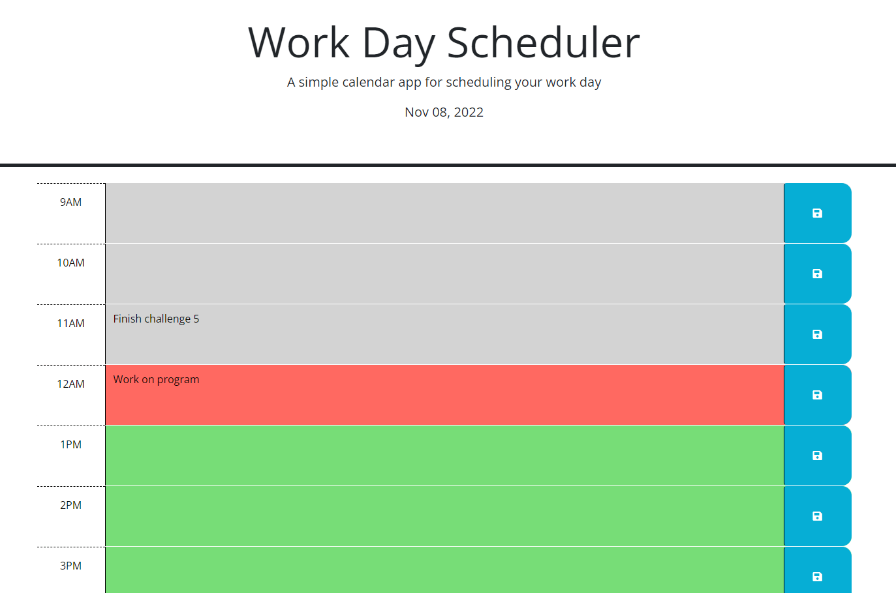

#Work Day Planner

## Description

This program allowes users to make notes for each hour of the work day. Each hour has it's own block that a user can write notes in and save to view later. There are blocks for 9am through 5pm, each hour in a average work day. The blocks are color coded to tell user the current hour(red), hour that has past(gray), and future hours(green). The program also gives the current date at the top of the page.

## Installation

link to the cite: https://nhatwin.github.io/hw-5/

## Usage

This program can be used to leave notes and TODOS for a user's work day. The program will hopfully make work more organized and less stressful. The color coded time blocks will allow users to see what hour it is and what they need to do based on the notes they left in the time block. Beyond that, the program was made to help practice using 3rd party API such as day.js and jquery.

## Screenshot

## Credits

N/A

## License

Please refer to the LICENSE in the repo.
